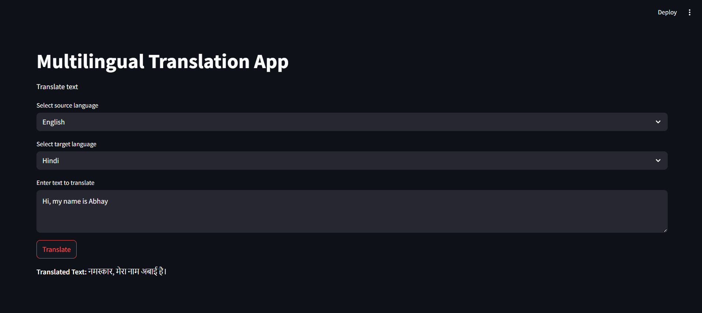
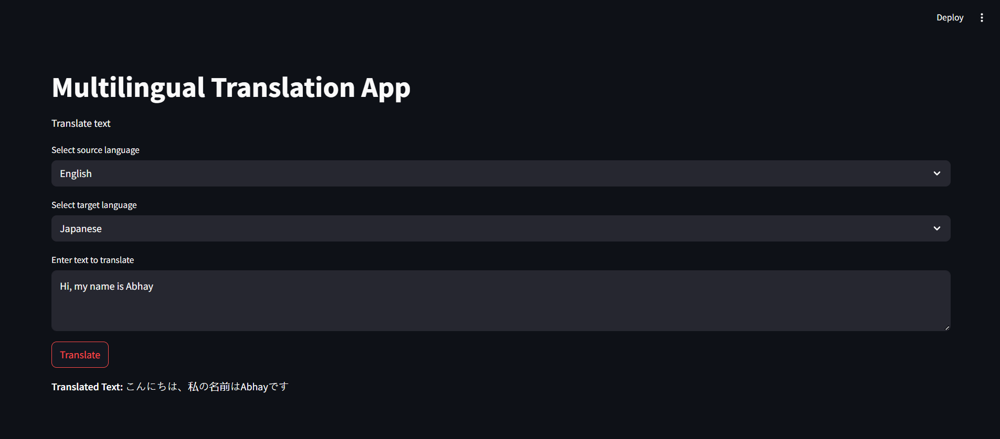
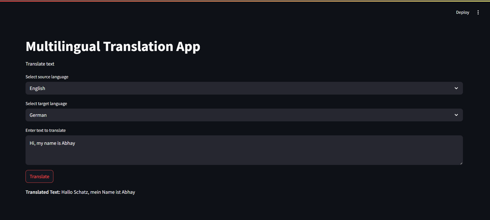

#  Multilingual Translation App – Summary & Learnings

##  Project Summary

This project demonstrates the creation of a multilingual translation web app using Streamlit as the UI framework and Hugging Face Transformers** for natural language translation.

Initially built with the powerful but slow `facebook/mbart-large-50-many-to-many-mmt` model, the app was later optimized for **faster and more practical deployment using lighter alternatives.

### App Features
-  Select source and target languages from a dropdown
- Enter text for translation
- View real-time translated output using pre-trained models

---

##  Key Learnings

-  Streamlit is an intuitive and effective framework for building quick NLP-based web apps.
-  Model choice impacts performance:
  - `mBART` is versatile and powerful but ~1.2GB in size.
  - Leads to very slow load times, unsuitable for free/lightweight hosting.
-  Caching with `@st.cache_resource` is essential to prevent reloading large models on every interaction.
-  Some models (like mBART) require additional libraries such as `sentencepiece`, which must be installed separately for tokenization to work.

---

## Results

This example demonstrates the translation of a simple English sentence into Hindi using the mBART-50 model. The translation preserves sentence structure and context effectively, showcasing the model’s ability to handle Indian languages with grammatical accuracy.

This example showcases the translation of English to Japanese, highlighting the model's capacity to manage non-Latin scripts. The sentence is translated fluently, maintaining the original intent and tone, and demonstrates the multilingual versatility of the mBART model.

Here, the model translates an English sentence to German with high fidelity. The output respects word order and grammatical agreement, which is particularly important in German. This shows the model’s strength in handling major European languages accurately.

